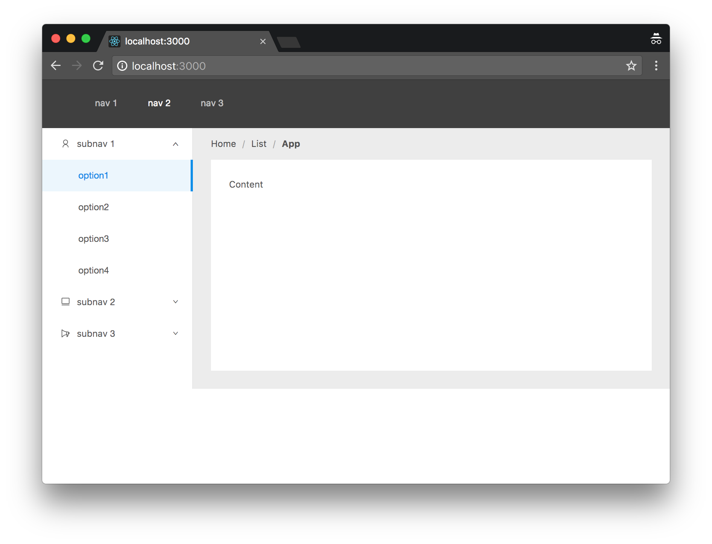

# Next with Antd

A simple example for showing how to initialize your frontend project with next.js and antd.

- [Including plain css files in Next.js project](https://github.com/zeit/next.js/tree/master/examples/with-global-stylesheet)
- [Ant.design layout example](https://ant.design/components/layout/)

## Bundle Sizes

### Development: npm run dev -> 2680KB

Name | Status | Type | Initiator | Size | Time
-- | -- | -- | -- | -- | --
localhost | 200OK | document | Other | 474 KB / 474 KB | 920 ms902 ms
index.js?ts=1553059908721/_next/static/development/pages | 200OK | script | (index)Parser | 1.7 MB / 1.7 MB | 253 ms13 ms
_app.js?ts=1553059908721/_next/static/development/pages | 200OK | script | (index)Parser | 348 KB / 347 KB | 16 ms12 ms
webpack.js?ts=1553059908721/_next/static/runtime | 200OK | script | (index)Parser | 34.1 KB / 33.8 KB | 13 ms13 ms
main.js?ts=1553059908721/_next/static/runtime | 200OK | script | (index)Parser | 880 KB/ 879 KB | 45 ms14 ms

### After build: npm run build && npm start -> 1310KB

Name | Status | Type | Initiator | Size | Time
-- | -- | -- | -- | -- | --
localhost | 200OK | document | Other | 470 KB / 470 KB | 177 ms174 ms
index.js/_next/static/o_DHRDq7ZCnL_FwLl6DHG/pages | 200OK | script | (index)Parser | 1.1 MB / 1.1 MB | 37 ms13 ms
_app.js/_next/static/o_DHRDq7ZCnL_FwLl6DHG/pages | 200OK | script | (index)Parser | 2.9 KB/ 2.6 KB | 13 ms13 ms
webpack-f0c6edbea5b547edc23f.js/_next/static/runtime | 200OK | script | (index)Parser | 1.7 KB / 1.5 KB | 16 ms15 ms
commons.649e134287af54e585ca.js/_next/static/chunks | 200OK | script | (index)Parser | 190 KB / 190 KB | 23 ms15 ms
main-7e3858c4094762b6abe9.js/_next/static/runtime | 200OK | script | (index)Parser | 15.9 KB / 15.6 KB | 21 ms15 ms

### Production (gzipped) -> 386KB

* 470K -> 57K index.html
* 2.6K -> 1.1K _app.js
* 190K -> 61K commons.649e134287af54e585ca.js
* 1.1M -> 261K index.js
* 16K -> 5.3K main-7e3858c4094762b6abe9.js
* 1.5K -> 769B webpack-f0c6edbea5b547edc23f.js
